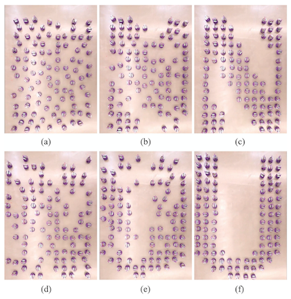

### About the Team

 Stephanie Ortiz-Sevilla

I am a senior double majoring in computer science and data science with a domain emphasis in robotics. My interest in robotics spans a wide range of areas within the field, including the area of robotic swarms. My experience lies primarily in engineering rather than research, and as such, my intrigue in swarms is tied to their many potential applications.


## Our Project

We set out to gain a comprehensive understanding of robotic swarms in several contexts. Our approach was to survey a range of research papers focusing on topics such as decentralized motion planning, obstacle avoidance, shape formation, and the hardware needed to accomplish the aforementioned. Through the knowledge gained from these literature reviews, we implemented our own robotic swarm decentralized motion planner for shape formation with the intent of acquiring a more nuanced, hands-on intuition for the subject. 

The project is of interest because there are a myriad of useful applications that could follow from a successful implementation. In most realistic settings, obstacles are inevitably part of the workspace – whether it be debris, furniture, or features specific to the environment. Shape formation is also an essential to performing divvied up tasks in dynamic circumstances. For instance, in the context of a warehouse setting,
a swarm of robots dispersed across the floor would only be useful if it could navigate through the obstacles one may encounter in such an environment like package racks and lifts. Each robot in the swarm would also have to reach a target position in a formation defined by the locations where tasks are to be completed. While this is occurring, for the purpose of convenience and efficiency, the productivity of the entire swarm should not be compromised by a subgroup malfunctioning agents. This is realized through decentralization. 

In the following sections, the research papers and our implementation are described in more detail.

### Literature Reviews

We reviewed a total of 8 papers. As mentioned above, each of them involve one or more of the following categories: decentralized motion planning, shape formation, obstacle avoidance, and hardware. The papers are listed and ordered below accordingly. 

##### _Shape Formation in Homogenous Swarms Using Local Task Swapping_

The paper presents a distributed algorithm that solves the tasks of assigning goal locations and creating collision-free paths to said goal locations concurrently. This allows for the identically-programmed robots in the swarm to form any user-specified shape efficiently without collisions. The algorithm was successfully in simulation and in real robots.

{width="300" height="300" style="display: block; margin: 0 auto" }

##### _Programmable Self-Disassembly for Shape Formation in Large-Scale Robot Collectives_

The paper takes a subtractive approach for large-scale swarms to autonomously form a wide range of user-specified shapes. Startinng from a dense configuration, each robot determines if it is part of the desired shape; those that are not proceed to remove themselves using an external light as a guide. The subtractive method leads to higher reliability and improved speed.

<p align="center">
  
</p>


##### _A Decentralized Control Algorithm for Swarm Behavior and Obstacle Avoidance in Unknown Environments_

The algorithm presented by the paper was based on the concept of Null Space Based behavioral approach to merge different swarm tasks. In particular, the algorithm focuses on sharing sensors’ data in order to avoid obstacles that can be detected in the environment. The success of the approach was shown through simulations in different environments.

<p align="center">
  
</p>


##### _A Swarm Robotic Exploration Strategy Based on an Improved Random Walk Method_

This paper proposes an improved random walk method in which each robot adjusts its step size adaptively to reduce the number of repeated searches by estimating the density of robots in the environment. Simulation experiments and experiments with actual robots showed that an area is covered more efficiently using the proposed method than it is using either Brownian motion or Levy flight.

<p align="center">
  
</p>


##### _A Fast, Accurate, and Scalable Probabilistic Sample-Based Approach for Counting Swarm Size_

The paper describes a distributed algorithm for computing the number of robots in a swarm, only requiring communication with neighboring robots. The algorithm can accomodate changes in the size the swarm, such as when robots are added or removed. The success of the proposed method is demonstrated in simulation and with a real swarm.

<p align="center">
  
</p>

##### _Interplay of Two Bat Algorithm Robotic Swarms in Non-Cooperative Target Point Search_

This paper considers the case of two identical robotic swarms deployed within the same environment to perform dynamic exploration seeking for two different unknown target points. The environment is also unknown as well as void of light, so no vision sensors can be used. The Bat Algorithm, based on the echolocation used by bats, is utilized to develop a solution.

<p align="center">
  
</p>


### Implementation

```markdown
Syntax highlighted code block

# Header 1
## Header 2
### Header 3

- Bulleted
- List

1. Numbered
2. List

**Bold** and _Italic_ and `Code` text

[Link](url) and 
```
#### Results

### Conclusion

In the end, we learned a lot about robotic swarms, and the different aspects that make them so promising. We now have a more expansive understanding of how distributed algorithms are designed, as well as how--even with a limited communication range--robots in a swarm can use shared data to accomplish tasks like shape formation and obstacle avoidance, among other things. This understanding was only reinforced by our experience in implementing part of what we surveyed ourselves. 

....[Difficulties of Implementation]... 

If we could change one thing, it would have been to test our implementation for with real robots in a more realistic environment. In the future, we would expand our implementation to include obstacle avoidance. While we surveyed possible methods to do so, we did not find the time to incorporate the feature, but we believe it would bring significant value.

For a more in-depth description of the project, refer to the following: [insert search paper link]
